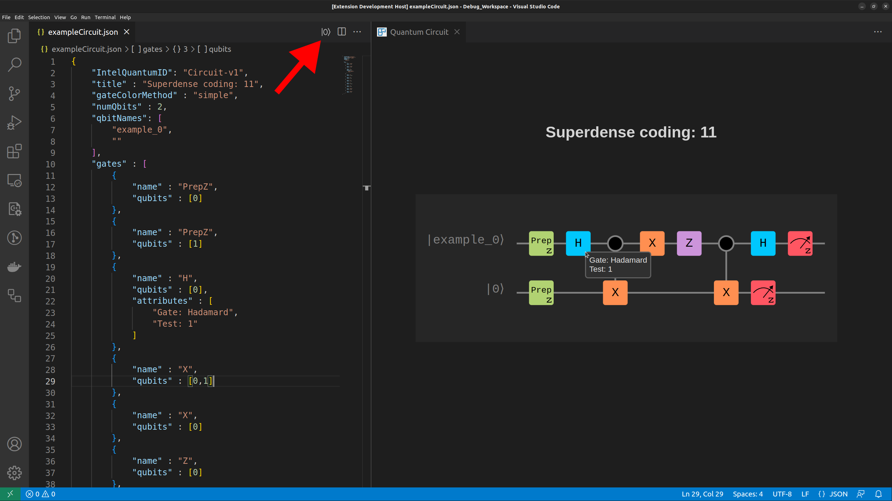
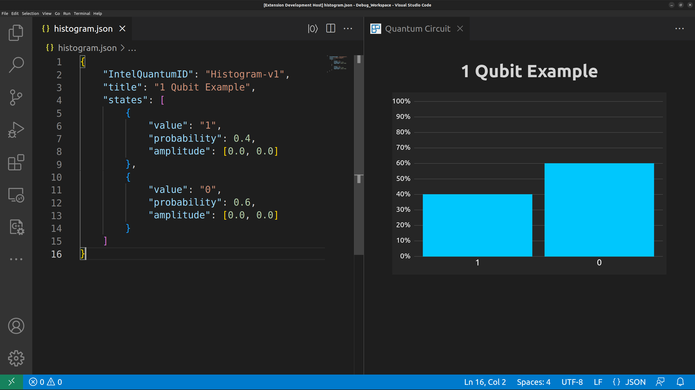

<a href="https://www.intel.com/content/www/us/en/research/quantum-computing.html">
    
</a>

# Intel<sub>®</sub> Quantum SDK Extension for VS Code

The purpose of this extension is to provide compilation and visualization tools for the C++ [Intel<sub>®</sub> Quantum Compiler](https://developer.intel.com/quantumsdk). The extension connects to the compiler and represents it's output as an exportable svg circuit board.

> Note: See `README-Dev.md` for development instructions

## Execute C++
In a valid Quantum C++ file there will be a `|0⟩` button on the right side of the tab bar. Clicking this button will compile and run the file, then display the output in a `.out` file.

> Note: Podman must be setup properly. See [Podman Setup](./README.md#podman-setup) for details

## Generate Circuit Board
In a valid Quantum C++ file there will be a button labeled `View Circuit` above every kernel. Clicking one of these buttons will generate a circuit board that will be displayed in the form of a [Webview](https://code.visualstudio.com/api/extension-guides/webview).

> Note: Podman must be setup properly. See [Podman Setup](./README.md#podman-setup) for details

## Podman Setup


## Export Circuit Board
Click on the tab with the generated circuit board to make it the active window. On the right side of the tab bar there will be an export button. This gives the user the option to export to an svg or png. The file will then appear as `title.(chosen extension)` in the directory opened in VS Code.

> Note: Exported images will be light or dark based on your VS Code theme. To change your theme in VS Code press `Ctrl` + `Shift` + `P` and enter `Color Theme`.

> Note: There is an issue where exported images do not contain Intel's custom font.

## Understanding the json
After clicking a `View Circuit` button above a kernel in a C++ file the circuit that is shown will be saved in [workspace]/visualization/circuits. After navigating to one of these json files there will be a button `|0⟩` on the right side of the tab bar. This will display the circuit board. Edits made to this json file will be reflected in the circuit board.



IntelQuantumID: Tells the extension that this json represents a quantum circuit board
``` json 
"IntelQuantumID": "Circuit-v1",
```

title: Sets the title of the circuit board
``` json 
"title" : "Teleport |1⟩",
```

gateColorMethod: Chooses one of a few styles that describes how the gates should be colored
> Note: Gate color methods include `default`, `clifford`, `axis`, and `simple`
``` json
"gateColorMethod": "simple",
```

numQbits: Defines the size of the y-axis and the number of qbits to display
``` json 
"numQbits" : 3,
```

qbitNames: Defines the name of each qbit. The drawer will dynamically size the circuit to accommodate longer names. Empty strings will be converted to |0⟩.
``` json 
"qbitNames" : [
	"example_0",
	"example_1",
	""
],
```

gates: Defines the gates that will be displayed on the circuit board. Gates require a name and a list of qbits to act upon. There is also an option to add attributes which will be displayed when the user hovers over that specific gate. Notice that some gates such as `MeasZ` have a custom gate icon.
``` json 
"gates" : [
	{
		"name" : "Prep",
		"qubits" : [0]
	}, ...
	{
		"name" : "H",
		"qubits" : [1],
		"attributes" : ["Gate: Hadamard", "Test: 1"]
	},
	{
		"name" : "X",
		"qubits" : [1,2]
	}, ...
	{
		"name" : "Z",
		"qubits" : [0,2]
	}, ...
	{
		"name" : "MeasZ",
		"qubits" : [0]
	}, ...
]
```

## Generate Histogram (Beta)
With a valid Intel Quantum Histogram Json file the user can generate a histogram to view the given state of a quantum system in graphical form.

> Note: The compiler does not print the json required to use this feature so the user must create the json themselves and the layout of the json is subject to change

> Note: This feature is still being developed and does not yet allow for exporting



## Syntax Highlighting
This extension extends the list of keywords that are highlighted by VSCode to include grammar from the [Intel<sub>®</sub> Quantum SDK](https://developer.intel.com/quantumsdk).

## 3rd Party Materials
| Project | Repo | License |
| ------- | ---- | ------- |
| [Panzoom](assets/javascripts/panzoom.js) | https://github.com/anvaka/panzoom | MIT |
| [Html2Canvas](assets/javascripts/html2canvas.js) | https://github.com/niklasvh/html2canvas | MIT |

## License
Copyright (c) 2023 Intel Corporation. All rights reserved.

Licensed under the [MIT](LICENSE.txt) license.