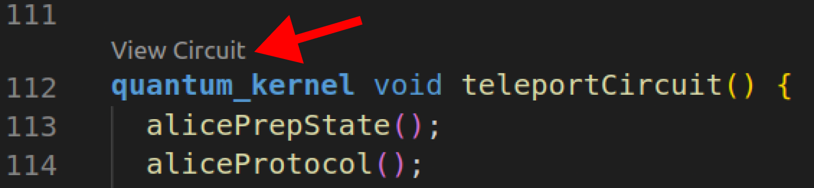
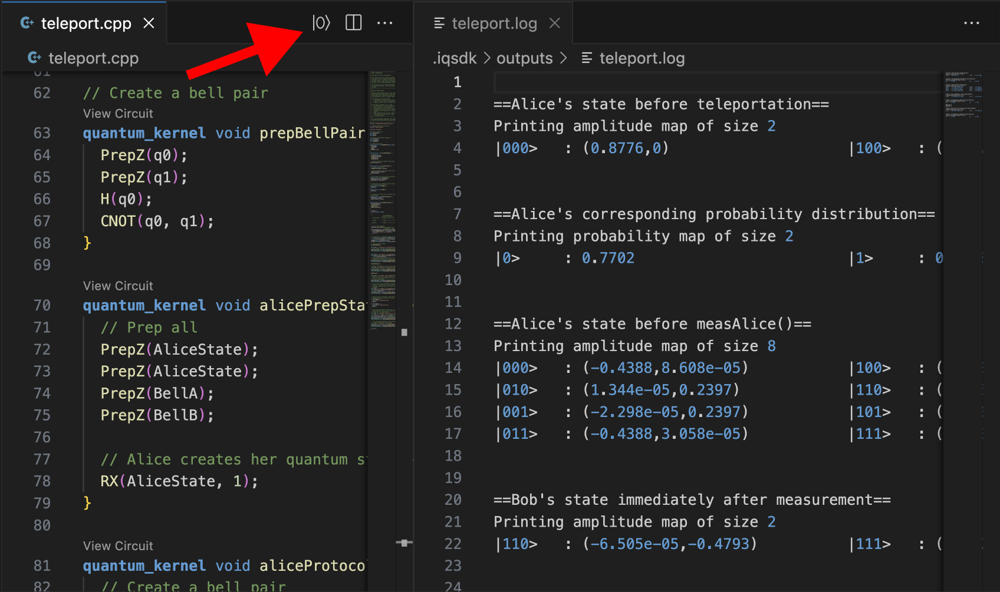

<a href="https://www.intel.com/content/www/us/en/research/quantum-computing.html">
    
</a>

# Intel<sub>®</sub> Quantum SDK Extension for VS Code

The purpose of this extension is to provide tools for the C++ [Intel<sub>®</sub> Quantum Compiler](https://developer.intel.com/quantumsdk). These tools include compilation and execution of C++ files as well as a circuit board generator for visualizing quantum code. The compiler can be seemlessly called from either a container or local installation of the SDK.

## Generate Circuit Board

### Generate Circuit from Kernel
Above every kernel in a valid Quantum C++ file there will be a `View Circuit` button. If a container engine or local SDK installation is set up then clicking this button will compile the C++ file, generate a circuit board, and display it to the user. 

> Note: See [Set Up](#set-up) for instructions on installing a container engine or installing the SDK locally.



### Edit and Generate Circuit from Json
After the compiler generates a circuit board, the information for the circuit will be stored in `.iqsdk/circuits/kernelName.json`. This file can be changed manually and then used to generate a circuit board using the `|0⟩` button on the right side of the tab bar.

> Note: For an indepth description of the circuit board json structure, see [Circuit Json Structure](#circuit-json-structure)


### Export Circuit as PNG
Click on the tab with the generated circuit board to make it the active window. On the right side of the tab bar there will be an export button. Clicking this button will open up a file explorer for saving the png.

> Note: Exported images will be light or dark based on your VS Code theme. To change your theme in VS Code press `Ctrl` + `Shift` + `P`, enter `Color Theme`, then select a dark or light theme from the drop down list.


## Execute Code
In a valid Quantum C++ file there will be a `|0⟩` button on the right side of the tab bar. If a container engine or local SDK installation is set up then clicking this button will compile the C++ file, execute the program, and display a log file with the output to the user. The log file will then be stored in `.iqsdk/outputs/fileName.log`

> Note: See [Set Up](#set-up) for instructions on installing a container engine or installing the SDK locally.



## Set Up
The extension requires either a container engine (Docker / Podman) or a local installation of the [Intel<sub>®</sub> Quantum Compiler](https://developer.intel.com/quantumsdk).

* Podman - Documentation and installation [here](https://podman.io/).
* Docker - Documentation and installation [here](https://www.docker.com/).
* Dev Containers - To remote into a container and run 'locally' from inside the container, search `Dev Containers` in the extension store. 
* IQSDK - To run the compiler locally see the [Intel<sub>®</sub> Quantum Compiler](https://developer.intel.com/quantumsdk)

### .iqsdk Folder
Whenever a function of the extension is used it will check for the .iqsdk folder. If the folder does not exist it will be generated.

This folder stores the following information:
* Circuits folder - Circuit board json files
* Outputs folder - Log files from execution
* Compile.json - Options for the compiler
* Terminal.log - Contains the output from the compiler after execution or circuit board generation.

### Compiler Options

#### Active Options 
active-circuit-option and active-execute-option. Sets which option will be used for circuit generation and file exectution.

#### Name
Defines the name of the option. Once defined the name can be used by either `active-circuit-option` or `active-execute-option`.

#### Remove
Boolean value that decides whether a container should be deleted after an event finishes.

#### Engine
Selects how the option will access the [Intel<sub>®</sub> Quantum SDK](https://developer.intel.com/quantumsdk).
* `podman`
* `docker`
* `local` - Must set [localSDKPath](#local-sdk-path) if this option is selected

> Note: If vscode is remoted into a container, use the `local` option and set the [localSDKPath](#local-sdk-path) to the full path from within the container.

#### Local SDK Path
Defines the full path to the [Intel<sub>®</sub> Quantum SDK](https://developer.intel.com/quantumsdk) for options where the `engine` option is set to `local`. 

#### Gate Color Methods
* `default` - Colors by general function of the gate
* `clifford` - Clifford gates are green, non-clifford gates are red, and prep/meas gates are blue
* `axis` - Colors gates based on the axis they act upon
* `simple` - Uses all colors on simple gates prep, meas, x, y, and z for a beginner friendly circuit board 

#### Args
A list of flags to be passed to the compiler. For example:
``` json
	"args" : [
        "-v",
        "-O0"
    ]
```

## Circuit Json Structure
IntelQuantumID: Tells the extension that this json represents a quantum circuit board
``` json 
"IntelQuantumID": "Circuit-v1",
```

title: Sets the title of the circuit board
``` json 
"title" : "Teleport |1⟩",
```

numQbits: Defines the size of the y-axis and the number of qbits to display
``` json 
"numQbits" : 3,
```

qbitNames: Defines the name of each qbit. The drawer will dynamically size the circuit to accommodate longer names. Empty strings will be converted to |0⟩.
``` json 
"qbitNames" : [
	"example_0",
	"example_1",
	""
],
```

gates: Defines the gates that will be displayed on the circuit board. Gates require a name and a list of qbits to act upon. There is also an option to add attributes which will be displayed when the user hovers over that specific gate. Notice that some gates such as `MeasZ` have a custom gate icon.
``` json 
"gates" : [
	{
		"name" : "Prep",
		"qubits" : [0]
	}, ...
	{
		"name" : "H",
		"qubits" : [1],
		"attributes" : ["Gate: Hadamard", "Test: 1"]
	},
	{
		"name" : "X",
		"qubits" : [1,2]
	}, ...
	{
		"name" : "Z",
		"qubits" : [0,2]
	}, ...
	{
		"name" : "MeasZ",
		"qubits" : [0]
	}, ...
]
```

gateColorMethod: Chooses one of a few styles that describes how the gates should be colored. For options see [Gate Color Methods](#gate-color-methods)
``` json
"gateColorMethod": "simple",
```

## Syntax Highlighting
This extension extends the list of keywords that are highlighted by VSCode to include grammar from the [Intel<sub>®</sub> Quantum SDK](https://developer.intel.com/quantumsdk).

## 3rd Party Materials
| Project | Repo | License |
| ------- | ---- | ------- |
| [Panzoom](assets/javascripts/panzoom.js) | https://github.com/anvaka/panzoom | MIT |
| [Html2Canvas](assets/javascripts/html2canvas.js) | https://github.com/niklasvh/html2canvas | MIT |

## License
Copyright (c) 2023 Intel Corporation. All rights reserved.

Licensed under the [MIT](LICENSE.txt) license.