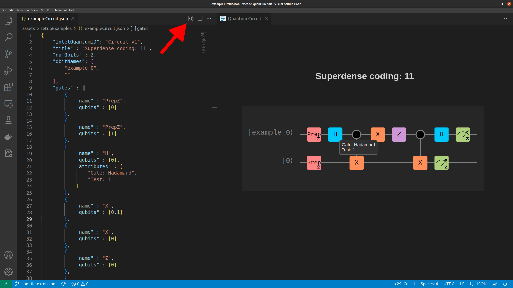

<a href="https://www.intel.com/content/www/us/en/research/quantum-computing.html">
    
</a>

# Intel<sub>®</sub> Quantum SDK Extension for VS Code

The purpose of this extension is to create a visual representation of code for the C++ [Intel<sub>®</sub> Quantum Compiler](https://developer.intel.com/quantumsdk) in the form of a circuit board.

> Note: See `README-Dev.md` for development instructions

## Generate Circuit Board
Navigate to a valid `.iqsdk.json` file that represents a quantum circuit board (Either test files or the output of the Quantum Compiler). Then press the |0⟩ button on the right side of the tab bar. This will display a [Webview](https://code.visualstudio.com/api/extension-guides/webview) containing the circuit board. 



## Understanding the json
``` json 
"title" : "Teleport |1⟩",
```
Sets the title of the circuit board

``` json 
"numQbits" : 3,
```
Defines the size of the y-axis and the number of qbits to display

``` json 
"qbitNames" : [
	"example_0",
	"example_1",
	""
],
```
Defines the name of each qbit. The drawer will dynamically size the circuit to accommodate longer names. Empty strings will be converted to |0⟩.

``` json 
"gates" : [
	{
		"name" : "Prep",
		"qubits" : [0]
	}, ...
	{
		"name" : "H",
		"qubits" : [1],
		"attributes" : ["Gate: Hadamard", "Test: 1"]
	},
	{
		"name" : "X",
		"qubits" : [1,2]
	}, ...
	{
		"name" : "Z",
		"qubits" : [0,2]
	}, ...
	{
		"name" : "MeasZ",
		"qubits" : [0]
	}, ...
]
```
Defines the gates that will be displayed on the circuit board. Gates require a name and a list of qbits to act upon. There is also an option to add attributes which will be displayed when the user hovers over that specific gate. Notice that some gates such as `MeasZ` have a custom gate icon.

## Syntax Highlighting
This extension extends the list of keywords that are highlighted by VSCode to include grammar from the Quantum SDK.

## 3rd Party Materials
| Project | Repo | License |
| ------- | ---- | ------- |
| [Panzoom](assets/javascripts/panzoom.js) | https://github.com/anvaka/panzoom | MIT |

## License
Copyright (c) 2023 Intel Corporation. All rights reserved.

Licensed under the [MIT](LICENSE.txt) license.